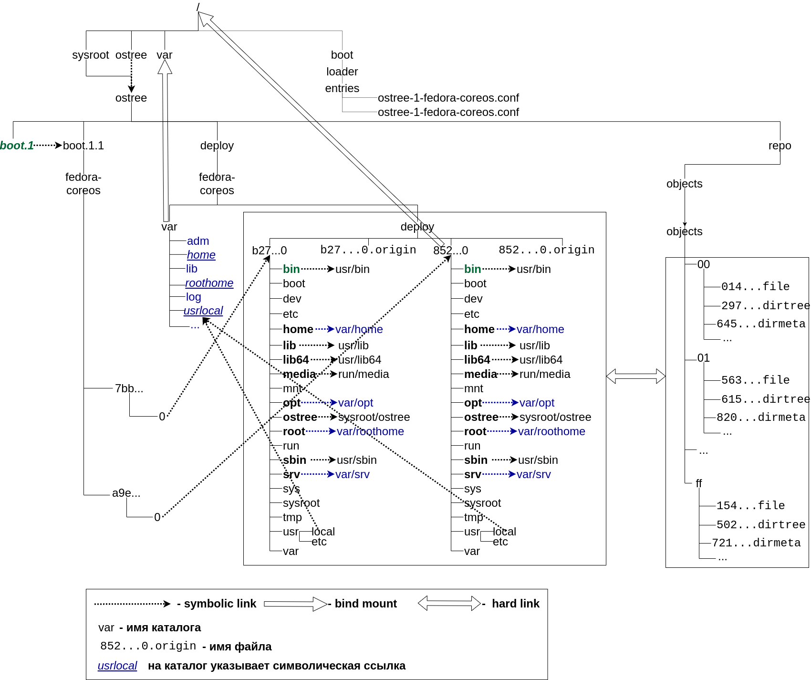

# Разворачивания (Deployments)

- Обзор
- «stateroot» (также известный как «osname»): группа развертываний (deployments) с общим /var
  * *Пример структуры файловой системы для Fedora Core*
- Содержимое развертывания (deployment)
- Загрузка системы - каталог /boot

## Обзор

Выше системы управления версиями OSTree находится уровень, который знает, как развертывать, параллельно устанавливать и управлять Unix-подобными операционными системами (доступными через администратора ostree). 
Основное содержимое этих операционных систем обрабатывается как доступное только для чтения (read only), но есть прозрачный механизм использования разднляемого хранилища 
доступного в режиме чтения-записи.

Развертывание физически расположено в `/ostree/deploy/$stateroot/deploy/$checksum` (где `/ostree` символическая ссылка на `/sysroot/ostree/`). 
`OSTree` предназначен для  загрузки одного `deployment` из нескольких; каждое развертывание является корневым каталогом для `chroot()` или его эквивалента. 

## «stateroot» (также известный как «osname»): группа развертываний (deployments) с общим /var

Каждое развертывание сгруппировано ровно в один «stateroot» (также известный как «osname»); первый термин предпочтительнее.

`stateroot` физически представлен в каталоге `/ostree/deploy/$stateroot`. 
Таким образом, `OSTree` может обеспечить параллельную установку `Debian` в `/ostree/deploy/debian` и `Red Hat Enterprise Linux` в `/ostree/deploy/rhel`
(при условии поддержки операционной системы, существующие выпущенные версии этих операционных систем могут не поддерживать это).

Каждый `stateroot` имеет ровно одну копию каталога `/var`, физически хранящуюся в `/ostree/deploy/$stateroot/var`. 
`OSTree` предоставляет инструменты поддержки для `systemd` для создания `bind mound`, которая гарантирует, что загружаемое развертывание (deploy) видит общую копию каталога `/var`.

`OSTree` не трогает содержимое каталога `/var`. 
Компоненты операционной системы, такие как службы демонов, необходимы для создания любых каталогов, которые им нужны в каталоге `/var` во время выполнения 
(например, `/var/cache/$daemonname`) 
и для управления обновлением форматов данных внутри этих каталогов. 

### *Пример структуры файловой системы для Fedora Core*

## Содержимое развертывания (deployment)

Развертывание начинается с определенной коммита (представленного как `хэш SHA256`) в репозитории `OSTree` в `/ostree/repo`. 
Этот коммит располагается в поддереве файловой системы, которое представляет собой корневой директорий развертывания (`deployment`). 
Для краткости мы будем называть это «`поддеревом`», чтобы отличать его от концепции развертывания (`deployment`).

Во-первых, поддерево должно включать `ядро` ​​(и, возможно, `initramfs`). 
Текущие стандартные расположения для них - это `/usr/lib/modules/$kver/vmlinuz` и `/usr/lib/modules/$kver/initramfs.img`. 
«`boot checksum`» будет вычислена автоматически. 
Это соответствует текущей структуре ядра `Fedora` и является текущим рекомендуемым подходом. 
Однако более старые версии `libostree` это не поддерживают; 
вам также может потребоваться поместить ядра в предыдущие (устаревшие) пути, которые представляют собой контрольную сумму `vmlinuz(-. *)?-$checksum` в `/boot` или `/usr/lib/ostree-boot`. 
Контрольная сумма должна быть `хэшем SHA256` содержимого `ядра`; она должна быть предварительно вычислена перед сохранением ядра в репозитории. 
Каталог также может также содержать `initramfs`, хранящийся как  `initramfs(-.*)?-$checkum`, и/или дерево устройств, хранящийся как `devicetree(-.*)?-$checkum`. 
Если существует `initramfs` или `devicetree`, контрольная сумма должна включать все содержимое ядра, `initramfs` и `devicetree`. 
`OSTree` будет использовать это, чтобы определить, какие `ядра` используются совместно. Причина в том, чтобы избежать вычисления контрольных сумм на клиенте по умолчанию.

В развертывании не должно быть традиционных UNIX-каталогов `/etc`; вместо этого он должен включать `/usr/etc`. Это «`конфигурация по умолчанию`». 
Когда `OSTree` создает развертывание, он выполняет трехстороннее слияние (3-way merge), используя `старую конфигурацию по умолчанию`, каталог `/etc` активной системы и `новую конфигурацию по умолчанию`. В конечном дереве файловой системы для развертывания (`deployment`) `/etc` является обычным каталогом с возможностью записи.

Помимо исключений `/var` и `/etc`, остальное содержимое каталогов дерева фиксируется как жесткие (`hard`) ссылки на файлы подкаталога `ostree/repo/objects/`. Настоятельно рекомендуется, чтобы операционные системы отправляли все свое содержимое в `/usr`, но это **не является жестким требованием**.

Наконец, развертывание может иметь файл `.origin`, хранящийся рядом с его каталогом. 
Этот файл сообщает `ostree admin upgrade`, как его обновить. 
На данный момент `OSTree` поддерживает обновление только одного `refspec`. 
Однако в будущем `OSTree `может поддерживать синтаксис для создания слоев деревьев. 

## Загрузка системы - каталог /boot

Кроме поддержки разворачиваний в каталоге `ostree/deploy` OSTree  должен управлять системным каталогом `/boot` для начальной загрузки системы. 
Это поддерживается через спецификацию загрузчика, которая является стандартом для файлов конфигурации, не зависящих от загрузчика.

Когда дерево развернуто, у него будет сгенерированный файл конфигурации вида  `/boot/loader/entries/ostree-$stateroot-$checksum.$serial.conf`. 
Этот файл конфигурации будет включать специальный аргумент `ostree = kernel`, который позволяет `initramfs` найти (и `chroot()` в) указанное развертывание.

В настоящее время не все загрузчики реализуют `BootLoaderSpec`, поэтому `OSTree` содержит код для некоторых из них для восстановления собственных файлов конфигурации 
(таких как `/boot/syslinux/syslinux.conf`). 
