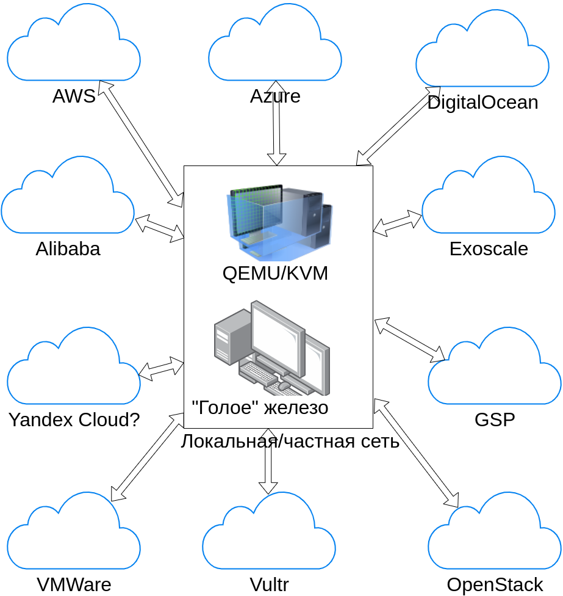

# Fedora CoreOS. Мы Федоре не враги

## Аннотация
В докладе будут рассмотрены история возникновения и ключевые особенности дистрибутива «Fedora CoreOS» и его аналогов.
Возможность реализации основных идей дистрибутива в расках операционной системы ALTLinux.

## Основные особенности Fedora CoreOs 

При разворачивании решения часто возникает задача разворачивания Linux-кластера серверов в различных средах:
- облачные сервисы: Alibaba, AWS, Azure, DigitalOcean, Exoscale, GCP, Vultr;
- виртуальные машины: QMU/KVN, VMWare, OpenStack;
- "голом" железе.

Как правило, в различных средах разворачиваются различные Linux-дистрибутивы с различными версиями операционных систем, системных библиотек и т.п..
В рамках каждой версии на различных узлах устанавливается различное программное обеспечение (ПО).
Если число узлов в кластере относительно невелико (несколько узлов) администрирование операционных систем (установка обновлений, закрытие уязвимостей, ...) на узлах является небольшой проблемой.
Если же число узлов исчисляется десятками и сотнями, грамотное администрирование разнородных операционных систем с различных установленным ПО становится невозможным.

`Fedora CoreOS` предлагает решение данной проблемы за счет использования следующих механизмов:
- Исключения участие оператора при разворачивании операционной системы. Для каждого узла в файле конфигурации задаются параметры развертывания (разбиение дисковой подсистемы, конфигурирование сетевых интерфейсов и DNS, настройка сервисов и контейнеров, ...). Установка операционной системы на различные вышеперечисленные платформы производится без участия оператора.
- Автоматическое обновления ядра и операционной системы из одного центра без участия оператора с возможностью приостановить автоматическое обновление и откатить на предыдущую ветку.
- Использование OSTree (git для бинарных файлов) позволяет:
  * откатывать состояние системы на предыдущие коммиты (точки фиксации)
  * разделить файловую систему на неизменяемую (`/usr/`), изменяемую (`/var/`) и обновляемую (`/etc`) части. Что позволяет:
    - упростить обновление бинарного программного кода системы;
    - исключить случайное удаление программного кода;
  * перегружать систему на предыдущие или последующие коммиты.
  * в случае необходимости администратор может, использую утилиту `rpm-ostree`
- Администратор кластера может останавливать часть узлов кластера при снижении нагрузки и восстанавливать их при повышении.
- Весь пользовательский софт работает в контейнерах (podman, moby engine == docker) в различных средах контейнеризации (docker swarm. k8s, ...). Это упрощает обновление системы и исключает изменение функционала пользовательского ПО после обновления системы. 
- Файловая система `Fedora CoreOS` достаточно небольшая (менее `4GB`), что позволяет ее использовать в устройствах `Интернета Вещей`.

Содержание операционной системы:
- последние свежие базоваие компоненты `Fedora` (RPM-пакеты);
- максимальная поддержка разнообразного железа (драйверы);
- Основные (терминальные) административные инструменты;
- Контейнерные движки: podman, moby engine;
- Отсутствие Python (в последних релизах присутствует).

## Потоки разработки Fedora CoreOS

Релизы `Fedora CoreOS` выпускаются в трех параллельных потоках:
- `next` - реализация экперементального функционала. После стабилизации выпускаются мажоные версии дистрибутива.
- `testing` - стабилизация RPM-пакетов. После стабилизации переводится в поток `stable`; 
- `stable` - самый надежный поток из перечисленных (публикация каждый 2 недели). 

## Fedora CoreOS vs Fedora IoT

Сходства:
- Использование `ostree`, `rpm-ostree` для поддержания неизменяемой операционной системы с атомарными изменениями.
- Использование `igniion` для автоматического разворачивания на множество аппаратных устройств.
- Пользовательские приложения разворачиваются в контейнерной среде.
- Поддержка `TPM2`, `SecureBoot` и автоматического расшифровки данных с устройств хранения с помощью `Clevis`. 

Различия:
- поддержка различных аппаратных платформ: `x86_64`,  `aarch64`,  `armhfp`. 
- упор на поддержку интернет-устройств и драйвером к ним;
- меньший объем дискового прострнства `~1.5GB`
- контейнеризация осуществляется через `podman`, поддержка клиент-серверной модели `moby engine` (`docker`) отсутствует;`
- веб-служба `Zezere` с помощью которого администраторы могут развертывать и настраивать `Fedora IoT` масштабируемым образом без физической консоли.

## Альт CoreOS

В рамках текущих продуктов, создаваемых на основе репозитория `Sisyphus`:
- `Альт Рабочая станция`;
- `Альт Сервер`;
- `Альт Сервер Виртуализации`;
- `Альт Образоание`;
- `Simply Linux`;
- ...

можно поддержать динейку дистрибутивов `Альт CoreOS` (и возможно `Альт IoT`).

В настоящий момент в `Sisyphus` портированы большинство пакетов `Fedora CoreOS`:
Пакет | Описание | Sisyphus  | Примечание
------|----------|-----------|------------
`ostree` | Система обновления версий операционных систем на базе Linux | **портирована**
`ignition` | Утилита для управления дисками во время начальной установки системы | **портирована**
`dracut` | Инструментарий создания  файловой системы начальной загрузки  `initramfs` | **портирован**  | В рамках ALTLinux используется собственный технологический процесс создания `initrams` 
`butane` | Утилита конвертации файлов описания конфигурации из формата `YAML` в формат `JSON Ignition` | - | Достаточно простая утилита
`coreos-installer` | Программа установки `CoreOs` | - | Возможно создание собственной программы
`rpm-ostree` | Аналог программы `apt-get` установки RPM-пакетов в файловую систему `ostree` | - | Возможно потребуется не весь функционал

Для создания и продвижения дистрибутива `Альт CoreOS` необходимо:
- портирование недостающих пакетов или создание собственных аналогов;
- создание или использование существующего ПО для развертывания дистрибутива в облачных средах, включая `Yandex Cloud`; 
- организация процедура создания образов дистрибутива и «выкатки» его на сервера.

## Список литературы
- [Fedora CoreOS Documentation](https://docs.fedoraproject.org/en-US/fedora-coreos/);
- [Ostee Documentation](https://ostreedev.github.io/ostree/)
- [Fedora CoreOS Introduction - Dusty Mabe (Red Hat)](https://www.youtube.com/watch?v=JepNm7R0LSo)
- [Fedora IoT.Основа для экосистем Интернета вещей и Device Edge](https://getfedora.org/ru/iot/)
- [Российский разработчик операционных систем «Альт»](https://www.basealt.ru/)
- [Репозиторий Sisyphus](http://www.sisyphus.ru/)

